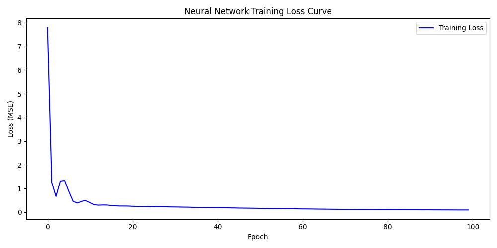
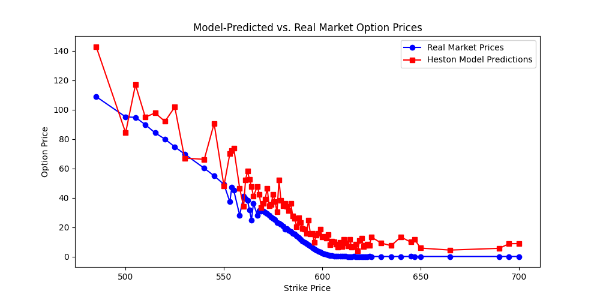

# Neural Network Calibration of the Heston Model using Monte Carlo Simulations

## Overview

This project calibrates the Heston stochastic volatility model using a neural network trained on synthetic option price data generated through Monte Carlo simulations. The model is then evaluated on real market option prices (SPY options) to test its effectiveness in capturing the price-strike relationship.

The Heston model is solved using the **Quadratic-Exponential (QE) scheme** proposed by **Leif Andersen (2008)** in his paper *Efficient Simulation of the Heston Stochastic Volatility Model*. Calibration is performed by predicting the Heston parameters from real market data using a feedforward neural network trained on simulated prices.

---

## Key Features

- **Real Market Data Integration**: Pulls historical SPY option prices and implied volatilities from Yahoo Finance.
-  **Neural Network Calibration**: Predicts Heston parameters (`kappa`, `theta`, `epsilon`, `rho`) from option prices using a trained neural network.
-  **Monte Carlo Simulation**: Prices European call options via simulation under the Heston model with the predicted parameters.
-  **Model Evaluation**: Compares predicted option prices with real market prices and visualizes the difference.
-  **Loss Curve Tracking**: Tracks and plots the training loss to monitor convergence of the neural network.

---

## File Structure

- `heston_model_neural.py`: Main script containing data collection, Heston simulation, training, prediction, and plotting logic.
- `loss_curve.png`: Output plot showing the training loss over epochs.
- `Heston_neural.png`: Output plot comparing real market prices vs. predicted prices as a function of strike.

---

## Dependencies

- Python 3.7+
- TensorFlow / Keras
- NumPy
- SciPy
- Matplotlib
- Pandas
- yFinance

Install them with:

```bash
pip install numpy scipy matplotlib pandas tensorflow yfinance
```

---

## How It Works

1. **Data Collection**  
   - Uses `yfinance` to fetch:
     - The SPY stock price from 30 days ago (`S0`)
     - Current SPY option chain (call options)
     - 3-Month Treasury Bill rate for risk-free rate (`r`)

2. **Synthetic Training Data Generation**  
   - Samples Heston parameters from realistic ranges.
   - Simulates option prices using Monte Carlo (QE scheme).
   - Forms dataset: option price → Heston parameters.

3. **Neural Network Training**  
   - A fully connected feedforward network with two hidden layers (64 units each, ReLU).
   - Trained with MSE loss to predict Heston parameters.

4. **Prediction & Evaluation**  
   - Real SPY market prices are fed into the trained model to estimate Heston parameters.
   - New option prices are generated using those parameters and compared to actual market prices.

---

## Example Output

 **Training Loss Curve**  


 **Model vs Market Prices**  


---

## References

- Andersen, Leif B.G. (2008). *Efficient Simulation of the Heston Stochastic Volatility Model*. SSRN: [Link](https://papers.ssrn.com/sol3/papers.cfm?abstract_id=946405)

---

## Future Improvements

- Add validation/testing splits to better monitor generalization.
- Compare NN calibration with traditional least-squares fitting.
- Extend to pricing American options or using alternative models (e.g., Bates, SABR).
- Increase Monte Carlo runs and time steps for higher fidelity.

---

## Author

Ioannis Hadjifrangiskou
Quantitative Finance Enthusiast | Python + Stochastic Models | 

---

## License

This project is open source and available under the [MIT License](LICENSE).
